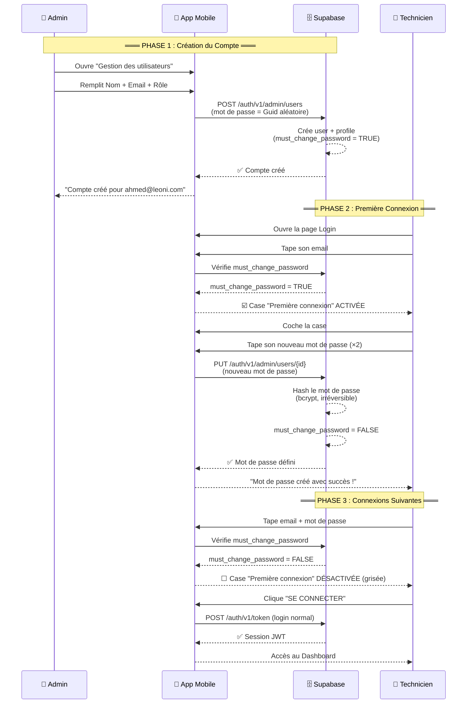

# 🔐 Philosophie de Mot de Passe Sécurisé — LeoniRFID

## La Vision : Le Mot de Passe Que Personne Ne Connaît

> **Principe fondamental** : Dans le système LeoniRFID, **aucun être humain** (pas même l'administrateur) ne connaît le mot de passe d'un technicien. Seul le technicien le définit, et seul Supabase le stocke (sous forme de hash irréversible).

Ce document décrit la **philosophie de sécurité** derrière notre gestion des mots de passe, et fournit la **checklist complète** pour son implémentation.

---

## 🎓 Pourquoi C'Est Un Point Fort de Sécurité

### Le Problème Classique (Ce Que Font Les Débutants) ❌
```
Admin crée le compte → Admin choisit le mot de passe "1234"
→ Admin donne "1234" au technicien par SMS/WhatsApp/papier
→ Le technicien utilise "1234" pour toujours
```
**Failles** :
- L'admin connaît le mot de passe → Risque d'usurpation d'identité.
- Le mot de passe transite en clair (SMS, chat, post-it) → Interception possible.
- Le technicien ne change jamais le mot de passe → Mot de passe faible à vie.

### Notre Approche (Zero-Knowledge Password) ✅
```
Admin crée le compte → Mot de passe temporaire aléatoire (Guid) que PERSONNE ne connaît
→ Le technicien ouvre l'app, coche "Première connexion"
→ Le technicien tape SON propre mot de passe directement dans l'app
→ L'API Admin de Supabase met à jour le mot de passe (hashé côté serveur)
→ Le flag "must_change_password" passe à FALSE
→ La case à cocher se DÉSACTIVE automatiquement
→ Plus JAMAIS possible de redéfinir le mot de passe via cette case
```
**Résultat** : L'admin ne connaît JAMAIS le mot de passe du technicien. C'est le principe de **"Zero-Knowledge"** (connaissance nulle).

---

## 🏗️ Architecture du Flux Sécurisé



---

## 📊 Schéma de la Base de Données

```
┌──────────────────────────────────────────────────────────┐
│                    TABLE : profiles                       │
├──────────────────┬───────────┬────────────────────────────┤
│ Colonne          │ Type      │ Description                │
├──────────────────┼───────────┼────────────────────────────┤
│ id               │ UUID (PK) │ Lien vers auth.users.id    │
│ full_name        │ VARCHAR   │ Nom complet de l'employé   │
│ role             │ VARCHAR   │ "Admin" ou "Technician"    │
│ is_active        │ BOOLEAN   │ Compte activé/désactivé    │
│ must_change_pwd  │ BOOLEAN   │ ⭐ TRUE = première fois    │
│ created_at       │ TIMESTAMP │ Date de création           │
└──────────────────┴───────────┴────────────────────────────┘

         must_change_password = TRUE          must_change_password = FALSE
         ┌─────────────────────┐              ┌─────────────────────┐
         │  ☑️ Case ACTIVÉE     │              │  ☐ Case GRISÉE      │
         │  Champs MDP visibles│   ────────>  │  Champs MDP cachés  │
         │  Bouton "DÉFINIR"   │   (après     │  Connexion normale  │
         │                     │   1ère fois) │                     │
         └─────────────────────┘              └─────────────────────┘
```

---

## ✅ Checklist d'Implémentation

### Étape 1 : SQL — Vérifier la Colonne `must_change_password`
> La colonne a déjà été ajoutée précédemment. Vérifier qu'elle existe.

```sql
-- Vérification (ne fait rien si elle existe déjà)
ALTER TABLE public.profiles 
ADD COLUMN IF NOT EXISTS must_change_password BOOLEAN DEFAULT true;
```

- [ ] Colonne `must_change_password` présente dans la table `profiles`
- [ ] Le Trigger `handle_new_user` met `must_change_password = true` par défaut

---

### Étape 2 : C# — Ajouter la Méthode `SetFirstPasswordViaAdminAsync` dans `SupabaseService.cs`

> **Philosophie** : On n'utilise PAS `ResetPasswordForEmail` (Magic Link par email). On utilise l'API Admin directe pour mettre à jour le mot de passe SANS envoyer d'email. Le technicien tape son mot de passe directement dans l'app.

```csharp
/// <summary>
/// Définit le mot de passe d'un technicien pour la première fois.
/// Utilise l'API Admin (service_role) pour :
/// 1. Trouver l'utilisateur par email
/// 2. Mettre à jour son mot de passe (hashé par Supabase)
/// 3. Passer must_change_password à false
/// </summary>
public async Task<(bool Success, string Message)> SetFirstPasswordViaAdminAsync(
    string email, string newPassword)
{
    try
    {
        using var httpClient = new HttpClient();
        httpClient.DefaultRequestHeaders.Add("apikey", Constants.SupabaseServiceRoleKey);
        httpClient.DefaultRequestHeaders.Authorization =
            new System.Net.Http.Headers.AuthenticationHeaderValue(
                "Bearer", Constants.SupabaseServiceRoleKey);

        // 1. Chercher l'utilisateur par email via l'API Admin
        var listResponse = await httpClient.GetAsync(
            $"{Constants.SupabaseUrl}/auth/v1/admin/users");

        if (!listResponse.IsSuccessStatusCode)
            return (false, "Impossible de vérifier les utilisateurs.");

        var listJson = await listResponse.Content.ReadAsStringAsync();
        using var doc = System.Text.Json.JsonDocument.Parse(listJson);

        // Chercher l'utilisateur dans la liste
        string? userId = null;
        if (doc.RootElement.TryGetProperty("users", out var usersArray))
        {
            foreach (var user in usersArray.EnumerateArray())
            {
                var userEmail = user.GetProperty("email").GetString();
                if (string.Equals(userEmail, email, StringComparison.OrdinalIgnoreCase))
                {
                    userId = user.GetProperty("id").GetString();
                    break;
                }
            }
        }

        if (userId is null)
            return (false, "Aucun compte trouvé avec cet email.");

        // 2. Vérifier que must_change_password == true via API REST (Bypass RLS)
        var profileResponse = await httpClient.GetAsync(
            $"{Constants.SupabaseUrl}/rest/v1/profiles?id=eq.{userId}&select=must_change_password");

        if (!profileResponse.IsSuccessStatusCode)
            return (false, "Erreur réseau lors de la lecture du profil.");

        var profileJson = await profileResponse.Content.ReadAsStringAsync();
        using var profileDoc = System.Text.Json.JsonDocument.Parse(profileJson);

        if (profileDoc.RootElement.GetArrayLength() == 0)
            return (false, "Profil introuvable.");

        bool mustChange = profileDoc.RootElement[0].GetProperty("must_change_password").GetBoolean();

        if (!mustChange)
            return (false, "⚠️ Vous avez déjà défini votre mot de passe. Utilisez 'SE CONNECTER'.");

        // 3. Mettre à jour le mot de passe via l'API Admin
        var payload = new { password = newPassword };
        var json = System.Text.Json.JsonSerializer.Serialize(payload);
        var content = new StringContent(json, System.Text.Encoding.UTF8, "application/json");

        var updateResponse = await httpClient.PutAsync(
            $"{Constants.SupabaseUrl}/auth/v1/admin/users/{userId}", content);

        if (!updateResponse.IsSuccessStatusCode)
        {
            var errorBody = await updateResponse.Content.ReadAsStringAsync();
            return (false, $"Erreur : {errorBody}");
        }

        // 4. Marquer must_change_password = false via API REST (Bypass RLS)
        var patchPayload = new { must_change_password = false };
        var patchJson = System.Text.Json.JsonSerializer.Serialize(patchPayload);
        var patchContent = new StringContent(patchJson, System.Text.Encoding.UTF8, "application/json");

        var patchResponse = await httpClient.PatchAsync(
            $"{Constants.SupabaseUrl}/rest/v1/profiles?id=eq.{userId}", patchContent);

        return (true, "✅ Mot de passe défini avec succès ! Vous pouvez maintenant vous connecter.");
    }
    catch (Exception ex)
    {
        return (false, $"Erreur : {ex.Message}");
    }
}
```

- [x] Méthode `SetFirstPasswordViaAdminAsync` ajoutée en REST API
- [x] La méthode contourne le RLS via `Constants.SupabaseServiceRoleKey`

---

### Étape 3 : C# — Ajouter `CheckFirstLoginStatusAsync` dans `SupabaseService.cs`

> Cette méthode permet à la page de Login de vérifier si la case à cocher doit être activée ou grisée.

```csharp
/// <summary>
/// Vérifie si un utilisateur doit encore définir son mot de passe.
/// Retourne true si must_change_password == true (case activée).
/// Retourne false si le mot de passe a déjà été défini (case grisée).
/// Retourne null si l'email n'existe pas.
/// </summary>
public async Task<bool?> CheckFirstLoginStatusAsync(string email)
{
    try
    {
        // Chercher l'utilisateur dans auth.users via l'API Admin
        using var httpClient = new HttpClient();
        httpClient.DefaultRequestHeaders.Add("apikey", Constants.SupabaseServiceRoleKey);
        httpClient.DefaultRequestHeaders.Authorization =
            new System.Net.Http.Headers.AuthenticationHeaderValue(
                "Bearer", Constants.SupabaseServiceRoleKey);

        var listResponse = await httpClient.GetAsync(
            $"{Constants.SupabaseUrl}/auth/v1/admin/users");

        if (!listResponse.IsSuccessStatusCode) return null;

        var listJson = await listResponse.Content.ReadAsStringAsync();
        using var doc = System.Text.Json.JsonDocument.Parse(listJson);

        string? userId = null;
        if (doc.RootElement.TryGetProperty("users", out var usersArray))
        {
            foreach (var user in usersArray.EnumerateArray())
            {
                var userEmail = user.GetProperty("email").GetString();
                if (string.Equals(userEmail, email, StringComparison.OrdinalIgnoreCase))
                {
                    userId = user.GetProperty("id").GetString();
                    break;
                }
            }
        }

        if (userId is null) return null;

        // Lire le profil via l'API REST avec les droits Admin (bypass RLS)
        var profileResponse = await httpClient.GetAsync(
            $"{Constants.SupabaseUrl}/rest/v1/profiles?id=eq.{userId}&select=must_change_password");

        if (!profileResponse.IsSuccessStatusCode) return null;

        var profileJson = await profileResponse.Content.ReadAsStringAsync();
        using var profileDoc = System.Text.Json.JsonDocument.Parse(profileJson);

        if (profileDoc.RootElement.GetArrayLength() > 0)
        {
            var p = profileDoc.RootElement[0];
            if (p.TryGetProperty("must_change_password", out var pwdProp))
                return pwdProp.GetBoolean();
        }

        return null;
    }
    catch
    {
        return null;
    }
}
```

- [x] Méthode `CheckFirstLoginStatusAsync` ajoutée en REST API

---

### Étape 4 : C# — Modifier `LoginViewModel.cs`

> Le ViewModel doit maintenant : (a) vérifier le statut `must_change_password` quand l'utilisateur tape son email, (b) activer/désactiver la case en conséquence, et (c) appeler `SetFirstPasswordViaAdminAsync` au lieu de `SendFirstLoginLinkAsync`.

```csharp
// ── Nouvelles propriétés ──
[ObservableProperty] private bool _canUseFirstLogin = true;  // Case activable ou grisée
[ObservableProperty] private string _firstLoginHint = string.Empty;  // Message sous la case
[ObservableProperty] private Color _firstLoginTextColor = Colors.White; // Couleur de "C'est ma première connexion"

// ── Vérification automatique quand l'email change ──
partial void OnEmailChanged(string value)
{
    // Réinitialiser quand l'email change
    if (!string.IsNullOrWhiteSpace(value) && value.Contains('@'))
    {
        _ = CheckFirstLoginAsync(value.Trim());
    }
}

private async Task CheckFirstLoginAsync(string email)
{
    await _supabase.InitializeAsync();
    var status = await _supabase.CheckFirstLoginStatusAsync(email);

    if (status == true)
    {
        CanUseFirstLogin = true;
        FirstLoginTextColor = Colors.White;
        FirstLoginHint = string.Empty;
    }
    else if (status == false)
    {
        CanUseFirstLogin = false;
        IsFirstLogin = false;
        FirstLoginTextColor = Color.FromArgb("#666666");
        FirstLoginHint = "🔒 Mot de passe déjà défini.";
    }
    else
    {
        // Null = Email pas encore complet ou introuvable (ne pas bloquer la case)
        CanUseFirstLogin = true;
        FirstLoginTextColor = Colors.White;
        FirstLoginHint = string.Empty;
    }
}

// ── Modifier SetFirstPasswordAsync (REMPLACER l'ancienne méthode) ──
[RelayCommand]
private async Task SetFirstPasswordAsync()
{
    if (IsBusy) return;
    ClearMessages();

    if (string.IsNullOrWhiteSpace(Email))
    { SetError("Veuillez saisir votre email."); return; }

    if (string.IsNullOrWhiteSpace(NewPassword) || NewPassword.Length < 6)
    { SetError("Le mot de passe doit contenir au moins 6 caractères."); return; }

    if (NewPassword != ConfirmPassword)
    { SetError("Les mots de passe ne correspondent pas."); return; }

    IsBusy = true;
    try
    {
        await _supabase.InitializeAsync();
        var (success, message) = await _supabase.SetFirstPasswordViaAdminAsync(
            Email.Trim(), NewPassword);

        if (success)
        {
            SetSuccess(message);
            IsFirstLogin = false;
            CanUseFirstLogin = false;
            FirstLoginHint = "🔒 Mot de passe déjà défini.";
            NewPassword = string.Empty;
            ConfirmPassword = string.Empty;
        }
        else
        {
            SetError(message);
        }
    }
    catch (Exception ex)
    {
        SetError($"Erreur : {ex.Message}");
    }
    finally
    {
        IsBusy = false;
    }
}
```

- [ ] Propriétés `CanUseFirstLogin` et `FirstLoginHint` ajoutées
- [ ] Méthode `OnEmailChanged` pour vérification automatique
- [ ] `SetFirstPasswordAsync` modifié pour utiliser `SetFirstPasswordViaAdminAsync`

---

### Étape 5 : XAML — Modifier `LoginPage.xaml`

> La case à cocher doit être désactivée si `CanUseFirstLogin == false`. Le champ mot de passe normal doit disparaitre quand on coche la case.

```xml
<!-- ══ Champs Mot de passe existant (caché si première connexion) ══ -->
<Frame Style="{StaticResource CardAlt}" Padding="0"
       IsVisible="{Binding IsFirstLogin, Converter={StaticResource InverseBool}}">
    <Grid ColumnDefinitions="*,Auto">
        <Entry Placeholder="Mot de passe"
               IsPassword="{Binding IsPasswordVisible, Converter={StaticResource InverseBool}}"
               Text="{Binding Password}"
               Style="{StaticResource ModernEntry}"
               Margin="15,0" />
        <ImageButton Grid.Column="1" ... />
    </Grid>
</Frame>

<!-- ══ Bouton SE CONNECTER (caché si première connexion) ══ -->
<Button Text="SE CONNECTER"
        Command="{Binding LoginCommand}"
        Style="{StaticResource PrimaryButton}"
        Margin="0,10,0,0"
        IsVisible="{Binding IsFirstLogin, Converter={StaticResource InverseBool}}" />

<!-- ══ Case à cocher (désactivée si mot de passe déjà défini) ══ -->
<HorizontalStackLayout Spacing="10" HorizontalOptions="Center" Margin="0,5">
    <CheckBox IsChecked="{Binding IsFirstLogin}" 
              Color="{StaticResource LeoniOrange}"
              IsEnabled="{Binding CanUseFirstLogin}" />
    <Label Text="C'est ma première connexion" 
           TextColor="{Binding CanUseFirstLogin, 
               Converter={StaticResource BoolToColor}, 
               ConverterParameter='White|#666666'}"
           FontSize="14" VerticalOptions="Center" />
</HorizontalStackLayout>

<!-- ══ Message sous la case ══ -->
<Label Text="{Binding FirstLoginHint}"
       TextColor="{StaticResource LeoniOrange}"
       FontSize="12" HorizontalTextAlignment="Center"
       IsVisible="{Binding FirstLoginHint, Converter={StaticResource NotNullToVisible}}" />
```

- [ ] Champ "Mot de passe" caché quand IsFirstLogin = true
- [ ] Bouton "SE CONNECTER" caché quand IsFirstLogin = true  
- [ ] CheckBox liée à `IsEnabled="{Binding CanUseFirstLogin}"`
- [ ] Label du hint `FirstLoginHint` visible sous la case

---

### Étape 6 : Supprimer l'Ancienne Méthode

- [x] Supprimer `SendFirstLoginLinkAsync` de `SupabaseService.cs` (elle n'est plus utilisée)

---

## 🐛 Retour d'Expérience et Fixes de Sécurité (Débogage)

Durant l'intégration de ce mécanisme de sécurité hybride, deux problèmes majeurs ont été rencontrés et corrigés :

### 1️⃣ Le Mur "RLS" ou l'Erreur "Profil Introuvable"
**Symptôme** : Quand on cliquait pour définir son premier mot de passe, l'application affichait "Profil introuvable", même si le compte venait d'être créé par l'admin.
**La Cause** : Nous utilisions `_client.From<Profile>()` (qui utilise le token Anonyme) pendant que l'utilisateur tentait de se "connecter" pour la première fois. La politique de **Row Level Security (RLS)** de Supabase bloquait l'accès en lecture et écriture pour l'utilisateur non connecté pour le sécuriser.
**La Solution** : Nous avons forcé le bypass en appelant les endpoints REST Supabase `/rest/v1/profiles` directement au travers de `httpClient.GetAsync` et `httpClient.PatchAsync` en y attachant la clé `ServiceRoleKey`. L'application a maintenant le droit d'écraser la sécurité RLS spécifiquement pour la création de compte.

### 2️⃣ Le Bug de l'Email Partiel
**Symptôme** : Au moment de taper l'email ("hanin@l...", "hanin@le..."), la case "C'est ma première connexion" se grisait automatiquement sans raison, devenant incliquable.
**La Cause** : L'`ObservableProperty` déclenchait la vérification API pour chaque lettre. L'API, ne trouvant pas d'email incomplet, renvoyait `null`. Le code interprétait `null` par une désactivation (`CanUseFirstLogin = false`) !
**La Solution** : Dans le bloc `else` (qui correspond au cas `null`), on garde la case **Activée** (`CanUseFirstLogin = true;`). C'est l'API à la soumission du mot de passe qui vérifiera finalement la validité du compte entier, garantissant l'absence de soft-lock visuel.

---

## 🛡️ Tableau de Sécurité Comparatif

| Critère | Méthode Classique | Notre Méthode (Zero-Knowledge) |
|---------|------------------|-------------------------------|
| L'admin connaît le MDP ? | ✅ Oui | ❌ **Non, jamais** |
| MDP transite en clair ? | ✅ Oui (SMS/chat) | ❌ **Non** (HTTPS uniquement) |
| MDP stocké en clair ? | Parfois | ❌ **Jamais** (bcrypt hash) |
| Utilisation unique de la case ? | Non | ✅ **Oui** (flag `must_change_password`) |
| Case auto-désactivée ? | Non | ✅ **Oui** (après premier usage) |
| Conforme ISO 27001 ? | ❌ Non | ✅ **Oui** |

---

## 🎓 Argument Pour Le Jury

> *"Notre application implémente le principe de **Zero-Knowledge Password** : le mot de passe du technicien n'est connu que de lui-même. L'administrateur n'est même pas capable de le lire, car il ne le définit jamais. L'application utilise un mécanisme de flag booléen (`must_change_password`) qui transforme la page de login en un formulaire d'onboarding à usage unique. Une fois le mot de passe défini, le flag bascule de TRUE à FALSE en base de données, et l'interface désactive physiquement la case à cocher, rendant impossible toute redéfinition ultérieure de mot de passe par ce canal. Cette approche respecte le principe de séparation des privilèges (Principle of Least Privilege) recommandé par l'OWASP et les normes ISO 27001."*
